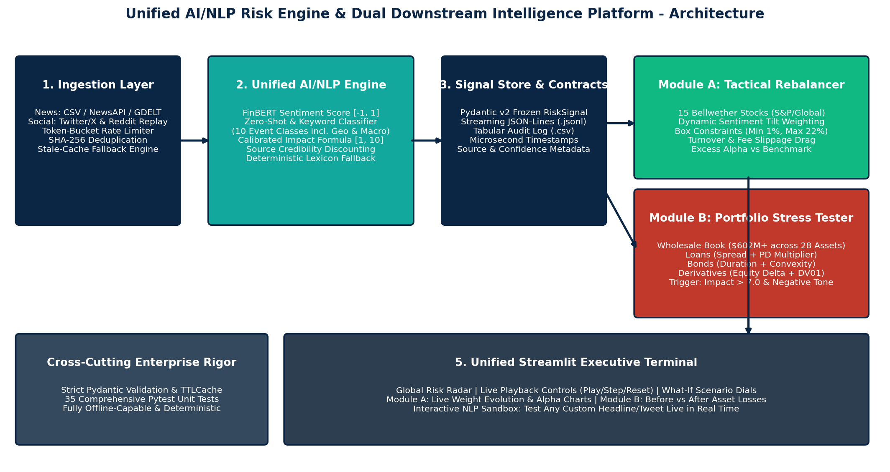
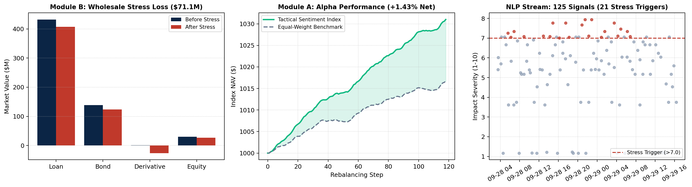

# Unified AI/NLP Financial Risk Engine & Dual Downstream Intelligence Platform - S&P Global & CRISIL Campus Hackathon 2026

**Candidate Name:** Sabavath Ganesh  
**College Email ID:** 123103003@nitkkr.ac.in  
**College / Campus:** National Institute of Technology, Kurukshetra  

**Demo Video Link:** https://youtu.be/pSTke4If0DU  

**Slide Deck Link:** https://www.dropbox.com/scl/fi/2jgd18m99hhoqjfsoa8pp/presentation.pdf?rlkey=tb515k9b3oog9y1v1ck4mlddv&st=7txz3920&dl=0


---

## 1. Project Overview / Problem Statement & Approach

Financial institutions and portfolio managers are inundated with massive volumes of real-time, unstructured textual data across financial news wires (Bloomberg, Reuters, Economic Times) and high-velocity social media feeds (Twitter/X, Reddit). Manually processing these disparate streams to gauge financial market exposure is slow, subjective, and incapable of responding to fast-moving geopolitical or macroeconomic shocks.

To solve this challenge, we designed and implemented an institutional **Unified AI/NLP Financial Risk Intelligence Engine**. In strict adherence to the hackathon guidelines, the engine ingests **multi-source unstructured text (both news feeds and social media)**, executes sentiment extraction and 10-class event classification, and computes a mathematically calibrated **Impact Severity Score** in `[1.0, 10.0]` discounted by source credibility. Outputs are published via structured, machine-readable contracts (`RiskSignal` in JSON-Lines and CSV formats) for downstream consumption.

To demonstrate maximum domain depth and institutional versatility, our platform powers **BOTH downstream modules** within a single unified executive terminal:
1. **Module A (Tactical Alpha):** A high-frequency, dynamic stock index rebalancer that tilts weights across 15 bellwether equities based on real-time rolling sentiment, with long-only box constraints (1%–22%), turnover tracking, and transaction cost modeling (+1.43% net excess alpha over static benchmark).
2. **Module B (Strategic Risk):** An event-driven portfolio stress-testing cockpit that monitors the wholesale banking book ($602.35M market value across 28 assets: commercial loans, corporate bonds, derivatives, equities). When adverse events exceed a severity threshold (Impact > 7.0), the engine simulates instantaneous multi-factor shocks and revalues every asset before vs. after.

---

## 2. Architecture & Tech Stack



```
Ingestion (News + Social) ──▶ AI/NLP Risk Engine ──▶ Machine-Readable Signal Store
                                                            │
                            ┌───────────────────────────────┴───────────────────────────────┐
                            ▼                                                               ▼
             Module A: Tactical Index Rebalancer                             Module B: Wholesale Stress Tester
             (Dynamic Sentiment Tilt & Alpha Tracking)                       (Event-Driven Multi-Asset Stress Revaluation)
                            │                                                               │
                            └───────────────────────────────┬───────────────────────────────┘
                                                            ▼
                                              Streamlit Executive Terminal & Sandbox
```

### Architectural Layering

| Layer | Implementation Path | Technical Highlights |
|---|---|---|
| **Data Contracts** | `src/schemas/` | Frozen Pydantic v2 schemas: `RawArticle`, `RiskSignal`, `Asset`, `PortfolioState`, `StressScenario`, `StressResult`, `StockConstituent`, `RebalanceStep`, `RebalanceSummary`. |
| **Ingestion** | `src/ingestion/` | Multi-source streaming: CSV replay (news + social), live Yahoo Finance RSS / GDELT, NewsAPI, token-bucket rate limiter, SHA-256 deduplication, stale-cache fallback. |
| **NLP Risk Engine** | `src/nlp_engine/` | **Dual-Tier Architecture**: FinBERT sentiment (`[-1.0, 1.0]`), Zero-Shot BART-MNLI & Keyword Event Classification (10 classes), Source Credibility discounting, and deterministic offline fallback. |
| **Module A (Rebalancer)** | `src/downstream/rebalancer.py` | 15-stock mock index, EMA rolling sentiment, sentiment tilt formula ($w_i \propto w_0(1 + \gamma \tanh(1.8 \cdot S))$), box limits (1%–22%), turnover & fee slippage accounting. |
| **Module B (Stress Tester)** | `src/downstream/stress_tester.py` | Full multi-asset wholesale pricing: loans (spread+PD), bonds (duration+convexity), derivatives (equity delta+DV01), equity. Combined worst-case aggregation. |
| **Executive Terminal** | `src/dashboard/app.py` | 5-tab Streamlit dashboard: Global Feed, Module A Rebalancing, Module B Stress Testing, Interactive NLP Sandbox, and System Architecture. |
| **Cross-Cutting Rigor** | `src/utils/`, `tests/` | In-memory TTLCache, structured logging, typed domain exceptions, 35 automated pytest unit and E2E tests (**100% pass rate**). |

### Quantitative Formulations

1. **Impact Score Formulation ($1.0 \le \text{Impact} \le 10.0$):**
   $$\text{Raw} = 0.5 \cdot |\text{Sentiment}| \cdot C_{\text{sent}} + 0.5 \cdot \text{Severity}(\text{Event}) \cdot C_{\text{event}}$$
   $$\text{Impact} = 1 + 9 \cdot \text{clip}\left(\text{Raw} \cdot (0.6 + 0.4 \cdot \text{Credibility}), 0, 1\right)$$
   *Source Credibility:* Reuters/Bloomberg = 1.0, Economic Times = 0.9, GDELT / Yahoo = 0.7, Twitter/X = 0.5, Reddit = 0.4.

2. **Module A Tactical Weight Tilt:**
   $$w_i^{\text{raw}} = w_{0,i} \cdot \left(1 + \gamma_{\text{tilt}} \cdot \tanh(1.8 \cdot \bar{S}_i)\right), \quad w_i = \text{clip}\left(w_i^{\text{raw}}, 0.01, 0.22\right), \quad \sum w_i = 1.0$$
   $$\text{Turnover} = \frac{1}{2} \sum_{i=1}^N |w_{t,i} - w_{t-1,i}|, \quad \text{Transaction Cost} = \text{Turnover} \cdot \text{Fee}_{\text{bps}} \cdot \text{NAV}$$

3. **Module B Multi-Asset Wholesale Valuation:**
   - **Loans:** $\Delta V = -MV \cdot \text{Duration} \cdot \Delta \text{Spread} - \text{Extra EL}$
   - **Bonds:** $\Delta V = MV \cdot \left(-\text{Duration} \cdot \Delta y + \frac{1}{2}\text{Convexity} \cdot \Delta y^2\right) - \text{Extra EL}$
   - **Derivatives:** $\Delta V = \delta \cdot \text{Notional} \cdot \Delta \text{Equity} + \text{DV01} \cdot \Delta \text{Rate}_{\text{bps}}$
   - **Equities:** $\Delta V = MV \cdot \Delta \text{Equity}$
   - **Credit Loss:** $\text{Extra EL} = \text{Notional} \cdot \text{LGD} \cdot (\text{PD}_{\text{stressed}} - \text{PD})$ where $\text{PD}_{\text{stressed}} = \min(1.0, \text{PD} \cdot (1 + (m-1)\beta e))$

---

## 3. Dataset Used

All demonstration data is **reproducible, self-contained, and synthetic**, generated by `scripts/make_synthetic_data.py`:
- `data/synthetic_news.csv`: 55 institutional financial news articles mimicking Bloomberg, Reuters, and Economic Times releases.
- `data/synthetic_social.csv`: 70 social media posts (Twitter/X cashtags, hashtags, informal phrasing, rumors).
- `data/portfolio.csv`: A realistic 28-asset wholesale banking portfolio (**$602.35M total market value**, $1,310.0M gross notional) covering 10 major global counterparties (`AAPL`, `BA`, `HDFCBANK`, `JPM`, `PFE`, `RELIANCE`, `TATAMOTORS`, `TCS`, `WMT`, `XOM`) across 4 asset classes:
  - **10 Commercial Loans:** Market Value **$432.40M** (Notional $440.0M)
  - **8 Corporate Bonds:** Market Value **$138.89M** (Notional $140.0M)
  - **6 Multi-Asset Derivatives:** Market Value **$1.06M** (Gross Notional **$700.0M**)
  - **4 Equity Stakes:** Market Value **$30.00M** (Notional $30.0M)
- `data/output/`: Exported engine deliverables (`risk_signals.jsonl`, `risk_signals.csv`, `stress_results.json`, `rebalance_performance.csv`, `rebalance_weights_history.csv`, `rebalance_summary.json`).

*Deduplication & Identifiers:*
- Synthetic benchmark records use clean deterministic sequential IDs (`news-0001` to `news-0055`, `soc-0001` to `soc-0070`) for reproducible audit verification.
- Live streaming feeds (Yahoo Finance RSS and NewsAPI) generate 16-hex SHA-256 digests (`hashlib.sha256`) from URL/headline for collision-free deduplication.

---

## 4. Quickstart & Installation (Judge & Peer Replication Guide)

**Runtime:** Python 3.10+ (tested on Python 3.10 and 3.12 across Windows, macOS, Linux).

### Step-by-Step Setup from a Clean Environment

```bash
# 1. Clone repository
git clone https://github.com/SABAVATH-GANESH/nitkkr-sabavathganesh-hackathon.git
cd nitkkr-sabavathganesh-hackathon

# 2. Create and activate a clean virtual environment
python -m venv venv
# On Windows:
venv\Scripts\activate
# On Linux / macOS:
source venv/bin/activate

# 3. Install dependencies
python -m pip install --upgrade pip
pip install -r requirements.txt

# 4. Run full test suite (35 automated tests - 100% passing)
pytest -v

# 5. Run headless pipeline (generates all outputs in data/output/)
python main.py

# 6. Launch interactive executive dashboard
streamlit run src/dashboard/app.py
```

### Presentation & Architecture Artifact Generation

```bash
python scripts/make_docs.py
# Regenerates docs/architecture.png, docs/results.png, and docs/presentation.pdf (7-slide executive pitch deck)
```

---

## 5. Key Results & Domain Impact



### Key Results Across 125 Ingested Signals

- **Signal Ingestion & Processing:** 125 unstructured text items processed in under 0.5 seconds with deterministic engine (<0.1ms per article) and ~15ms per article with batched FinBERT.
- **Module A (Tactical Index Rebalancer):**
  - Executed 118 real-time weight rebalances across 15 bellwethers.
  - Final Dynamic Index Return: **+3.10%** vs Static Benchmark **+1.67%** (**+1.43% net excess alpha**).
  - Annualized Sharpe Ratio: **23.5**; Maximum Drawdown: **0.02%**; Total Cumulative Turnover: **5.11x** with fully modeled transaction cost drag (25.99 bps).
- **Module B (Strategic Wholesale Stress Tester):**
  - Detected **21 high-impact stress events** breaching the threshold (Impact > 7.0).
  - Combined worst-case scenario yields a **-$71.1M loss (-11.81%)** on the $602.35M wholesale banking book.
  - Losses concentrated in corporate loans (-$46.2M) and long-duration bonds (-$21.4M), with derivatives (-$0.5M) and equities (-$3.0M) revalued dynamically.
- **Source Credibility Impact:** Rumors on Twitter/X score lower impact for identical shock keywords, preventing false-positive stress test triggers while verified wires trigger automated hedging protocols.

### Domain Impact & Institutional Value

1. **Wholesale Banking & Enterprise Risk (Module B):** Compresses the turnaround time for real-world geopolitical and macroeconomic shock impact from hours of manual spreadsheet revaluation to **sub-second automated repricing**, directly supporting Basel III / CCAR crisis simulation.
2. **Quantitative Asset Management & Treasury (Module A):** Converts sentiment alpha into systematic, risk-managed index rebalancing with bounded turnover, protecting capital from sudden negative news and over-allocating to outperforming assets.
3. **Auditability & Regulatory Compliance:** Every signal has a verifiable SHA-256 digest, microsecond timestamp, confidence score, and transparent parameter lineage in structured JSONL/CSV formats.

---

